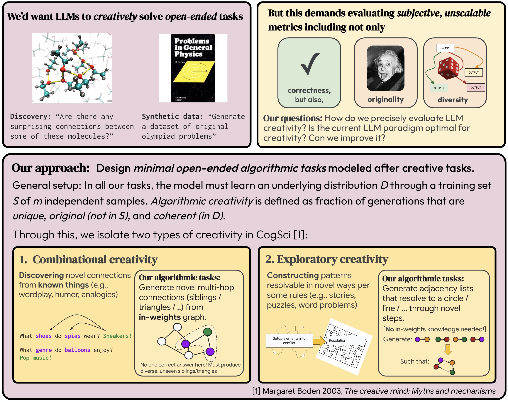

# Algorithmic Creativity

Code and data of our paper:<br>
**Roll the dice & look before you leap: Going beyond the creative limits of next-token prediction** <br>
Vaishnavh Nagarajan*<sup>1</sup>, Chen Henry Wu*<sup>2</sup>, Charles Ding<sup>2</sup>, Aditi Raghunathan<sup>2</sup><br>
<sup>1</sup>Google Research, <sup>2</sup>Carnegie Mellon University <br>
_ICML 2025 (spotlight)_ <br>
[**Paper**](https://arxiv.org/abs/2504.15266) | [**Data examples**](https://huggingface.co/collections/ChenWu98/algorithmic-creativity-6834c1b60ee58242df9da20c)


<div align=center>
    
</div>
<br>

<b>Note:</b> we have experiments with both Gemma 2B and GPT-2/SEDD in the paper, while this repo only contains the GPT-2/SEDD code.

## Code structure

```text
sibling-discovery        # code for Sibling Discovery
├── ntp                      # with next-token training
├── teacherless              # with teacherless training
└── diffusion                # with diffusion training
triangle-discovery       # code for Triangle Discovery
├── ...
circle-construction      # code for Circle Construction
├── ...
line-construction        # code for Line Construction
├── ...
simpletransformers       # helper code for Transformer models
```

## Setup

We use `simpletransformers` to train and test the Transformer models (for NTP and teacherless training).
To set up, please follow the installation instructions in `simpletransformers/README.md`.

For diffusion model training and inference, we use [Score-Entropy-Discrete-Diffusion](https://github.com/louaaron/Score-Entropy-Discrete-Diffusion). We have provided self-contained copies under `{task}/diffusion/`, so no need to clone the repo. Please follow the dependency installation instructions in their README.

All experiments can be run on a single A6000 GPU. Batch sizes are tuned on this device.

## Data generation

We provide Jupyter notebooks to replicate the data generation process. Paths in the notebooks need to be adjusted to your local environment.

### Sibling Discovery

To get data with hash-conditioning, run all blocks in:

`sibling-discovery/ntp/sibling.ipynb`

Here is an example of what the data would look like: [sibling example](https://huggingface.co/datasets/ChenWu98/sibling.5.500.10.50000)

To get data without hash-conditioning, run all blocks in:

`sibling-discovery/ntp/sibling_no_hash.ipynb`

### Triangle Discovery

To get data with hash-conditioning, run all blocks in:

`triangle-discovery/ntp/triangle.ipynb`

Here is an example of what the data would look like: [triangle example](https://huggingface.co/datasets/ChenWu98/triangle.10)

To get data without hash-conditioning, run all blocks in:

`triangle-discovery/ntp/triangle_no_hash.ipynb`

### Circle Construction

To get both data with and without hash-conditioning, run all blocks in:

`circle-construction/ntp/circle.ipynb`

Here is an example of what the data would look like: [circle example](http://huggingface.co/datasets/ChenWu98/circle.10.9.10.10000)

### Line Construction

To get both data with and without hash-conditioning, run all blocks in:

`line-construction/ntp/line.ipynb`

Here is an example of what the data would look like: [line example](https://huggingface.co/datasets/ChenWu98/line.10.9.10.10000)

## Training and evaluation

To run the experiments, replace `{task}` with `sibling-discovery`, `triangle-discovery`, `circle-construction`, or `line-construction`. All experiments can be run on a single A6000 GPU. Batch sizes are tuned on this device.

### Next-token prediction

Working directory for NTP is `{task}/ntp`:

```bash
cd {task}/ntp
```

Run the training script:

```bash
bash run_train.sh
```

Run the evaluation script:

```bash
bash run_eval.sh
```

The evaluation script will print the scores for each saved checkpoint.

### Teacherless training

Working directory for teacherless training is `{task}/teacherless`:

```bash
cd {task}/teacherless
```

We provide Jupyter notebooks to preprocess the dataset for teacherless training. Run all blocks in (adjust the paths in the notebook to your local environment):

`{task}_hybrid.ipynb`

Run the training script:

```bash
bash run_train.sh
```

Run the evaluation script:

```bash
bash run_eval.sh
```

The evaluation script will print the scores for each saved checkpoint.

### Diffusion models

Working directory for diffusion models should be `{task}/diffusion`:

```bash
cd {task}/diffusion
```

Run the training script:

```bash
bash run_train.sh
```

Run the evaluation script:

```bash
bash run_eval.sh
```

The evaluation script will print the scores for each saved checkpoint.

## Citation

If you find this code useful, please consider citing our paper:

```bibtex
@misc{nagarajan2025roll,
    title={Roll the dice & look before you leap: Going beyond the creative limits of next-token prediction},
    author={Vaishnavh Nagarajan and Chen Henry Wu and Charles Ding and Aditi Raghunathan},
    year={2025},
    eprint={2504.15266},
    archivePrefix={arXiv},
    primaryClass={cs.LG}
}
```
